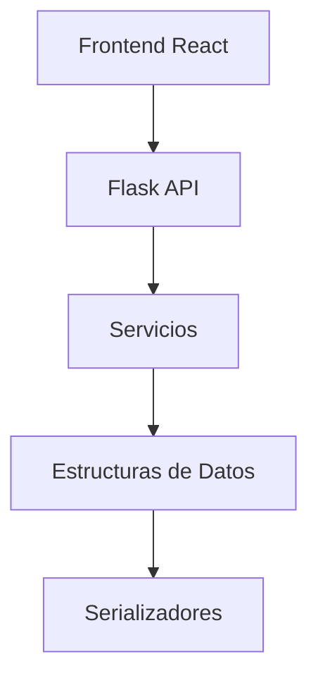
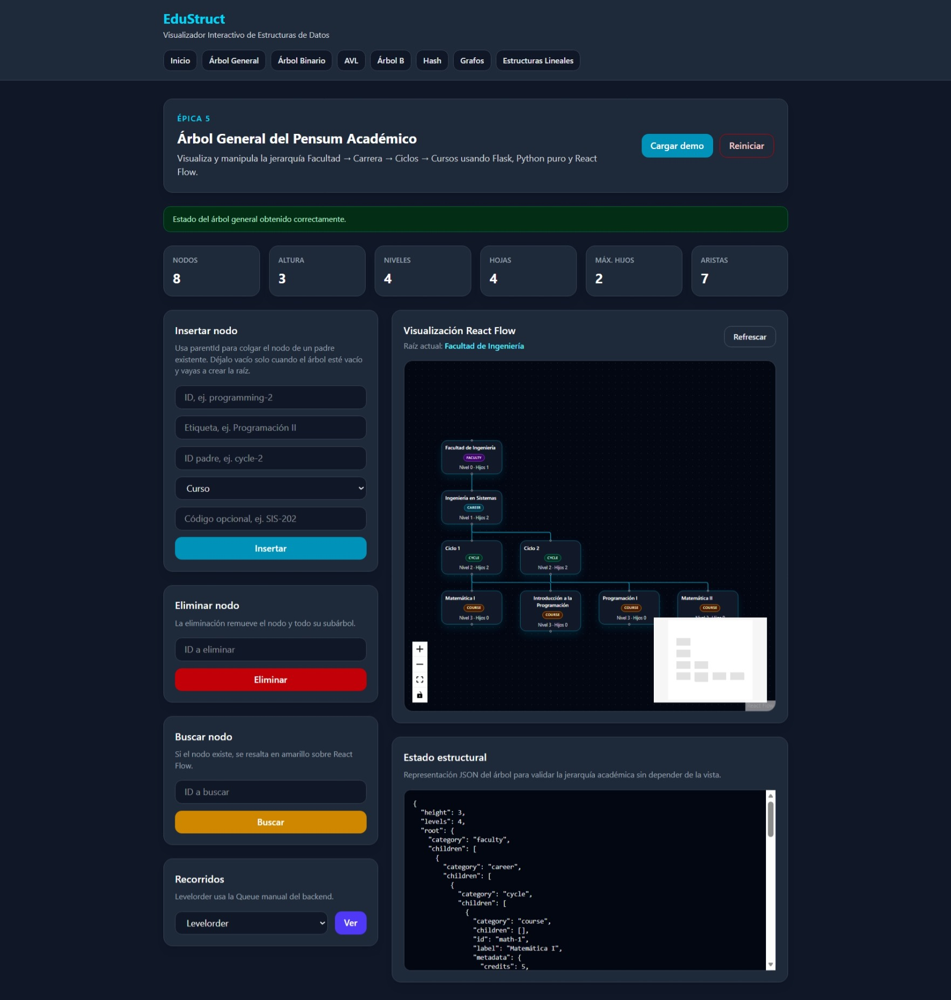
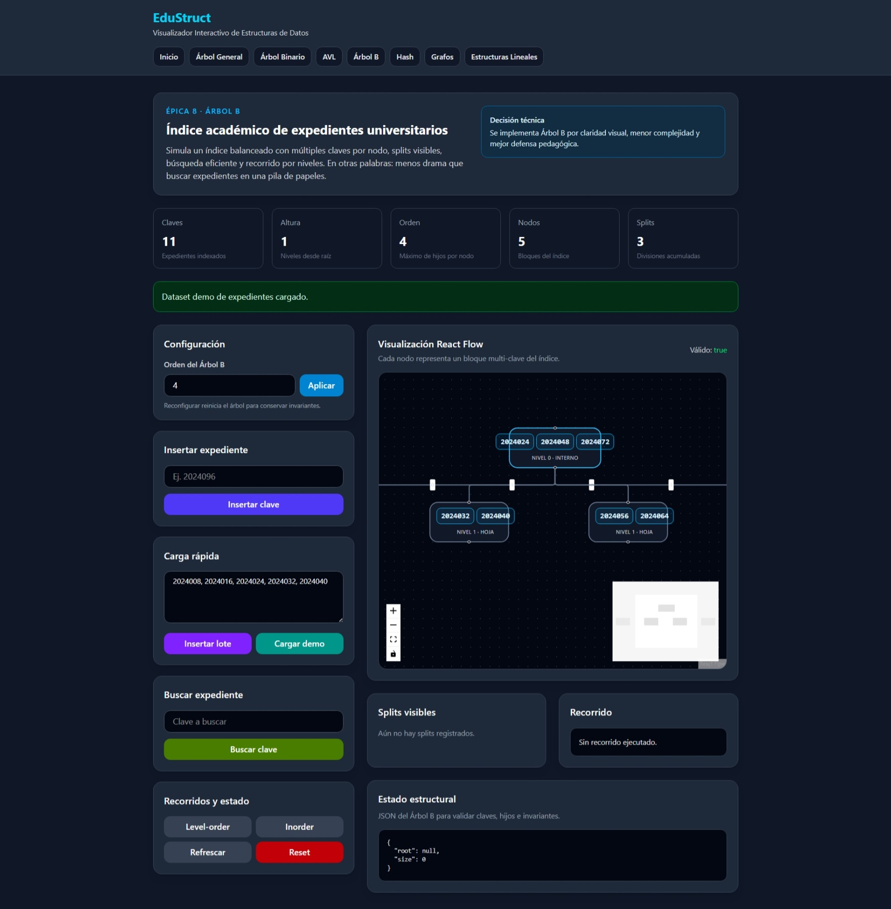
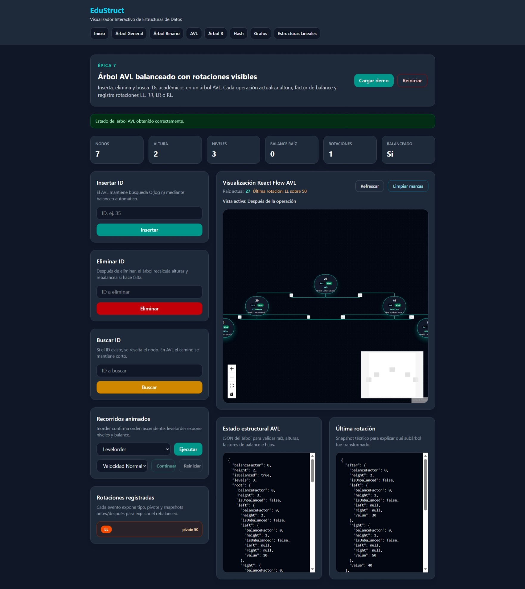
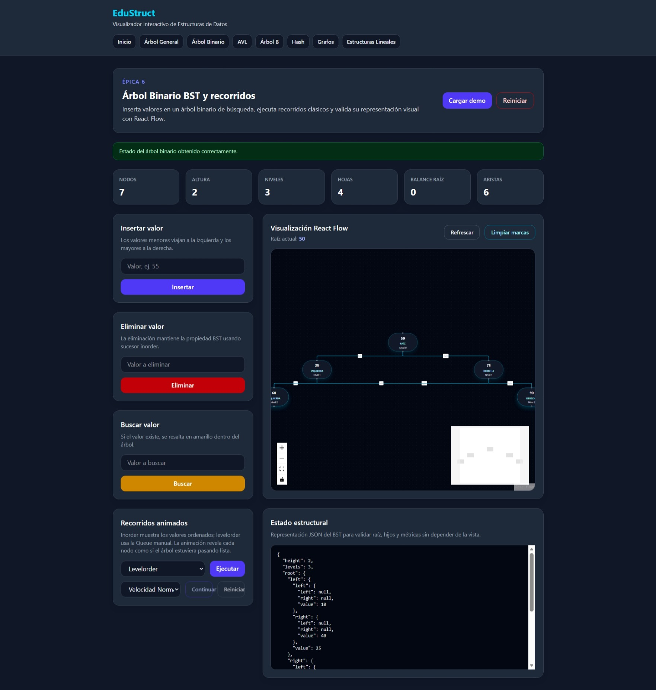
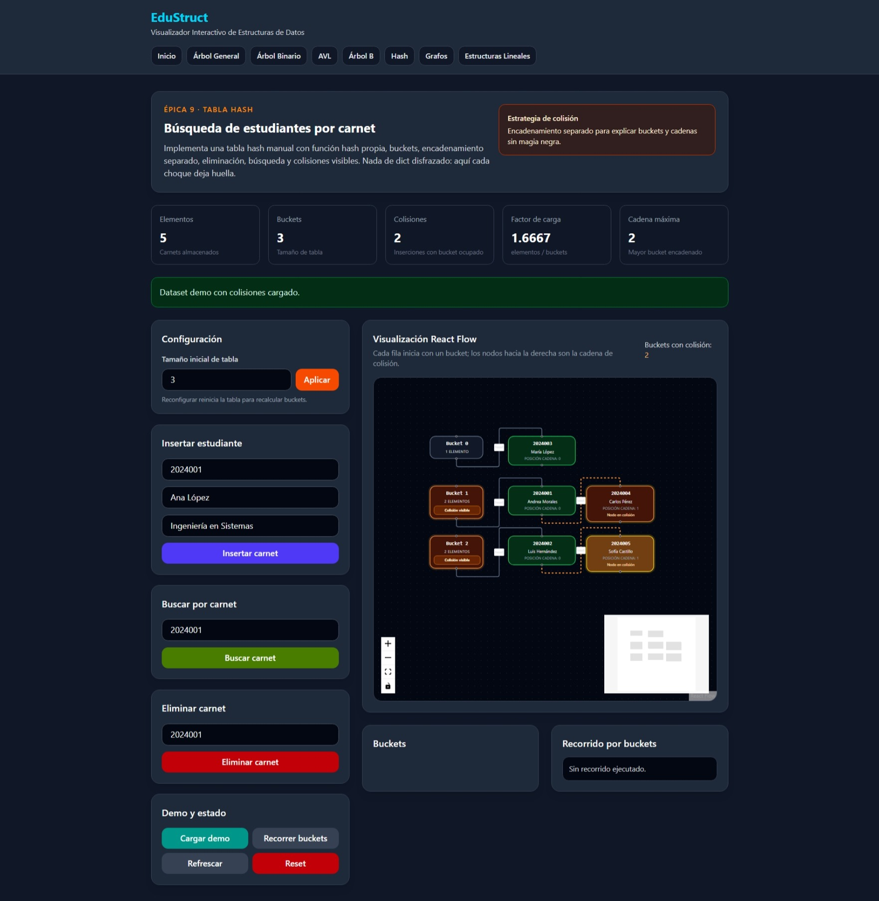
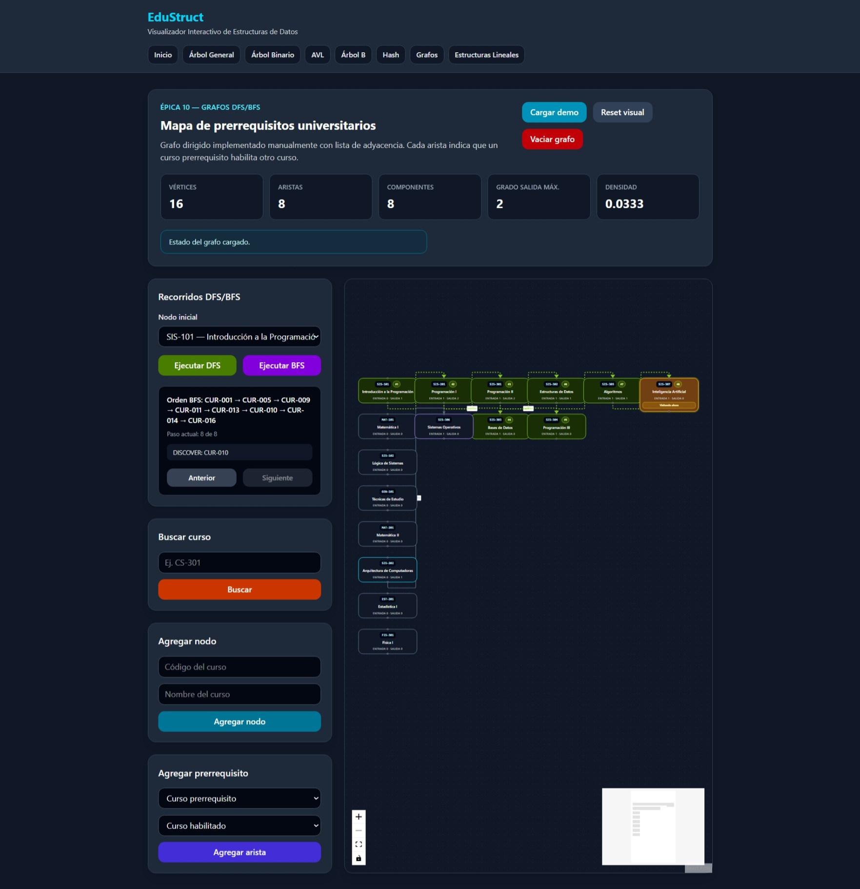
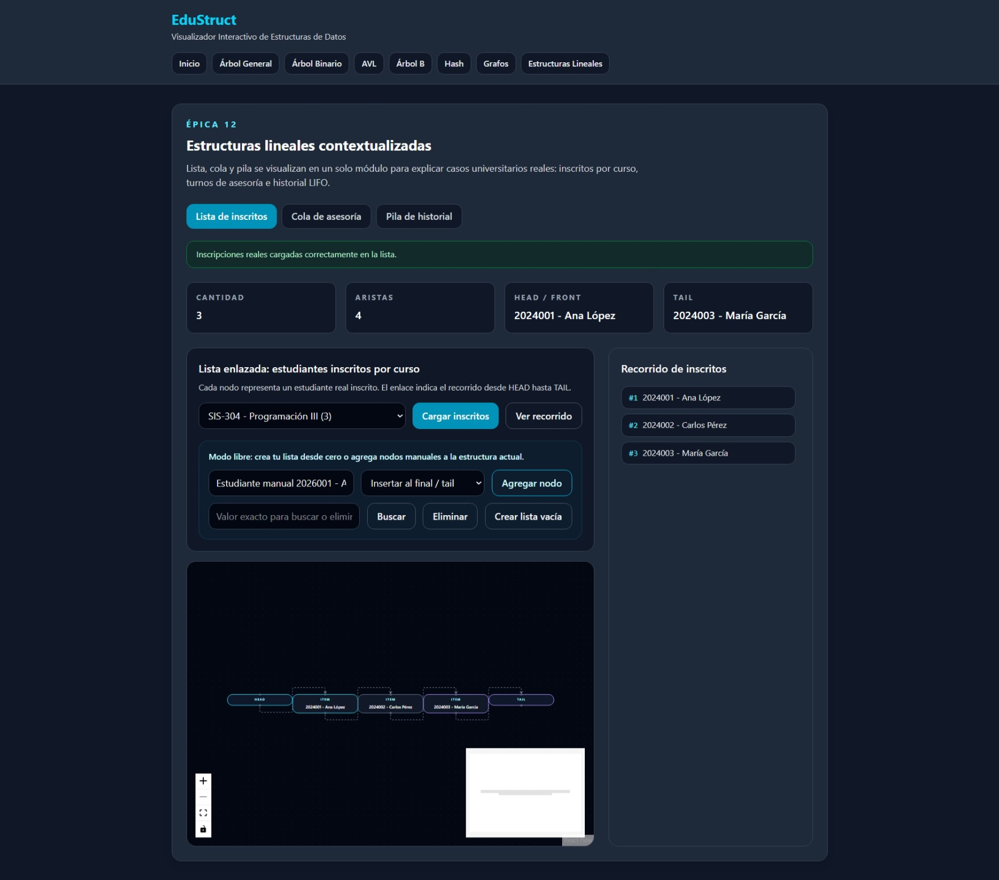

# EduStruct — Memoria Técnica del Proyecto

## Programación III  
### Visualizador Interactivo de Estructuras de Datos Aplicadas al Dominio Educativo

---

# Información General

| Campo | Información |
|---|---|
| Proyecto | EduStruct |
| Curso | Programación III |
| Tipo | Proyecto Académico |
| Arquitectura | Frontend + Backend desacoplado |
| Frontend | React + Vite |
| Backend | Flask |
| Visualización | React Flow |
| Lenguaje principal backend | Python |
| Lenguaje principal frontend | JavaScript |

---

# Tabla de Contenidos

1. Introducción  
2. Objetivos  
3. Alcance del Sistema  
4. Arquitectura General  
5. Stack Tecnológico  
6. Organización del Proyecto  
7. Modelo del Dominio Educativo  
8. Implementación de Estructuras  
9. APIs REST  
10. Visualización Interactiva  
11. Complejidad Algorítmica  
12. Dockerización y Entorno  
13. Resultados Obtenidos  
14. Conclusiones  
15. Trabajo Futuro  
16. Anexos  

---

# 1. Introducción

EduStruct es una plataforma académica desarrollada para visualizar estructuras de datos clásicas mediante un enfoque interactivo y contextualizado al dominio universitario.

El proyecto busca demostrar la implementación manual de estructuras fundamentales utilizando algoritmos reales, visualización gráfica y separación arquitectónica entre frontend y backend.

A diferencia de simuladores estáticos o ejemplos aislados, EduStruct integra:

- Árboles jerárquicos académicos
- Índices balanceados
- Grafos de prerrequisitos
- Tablas hash con colisiones
- Estructuras lineales contextualizadas
- Recorridos visuales
- Métricas estructurales

Todo ello mediante una arquitectura moderna basada en Flask, React y React Flow.

---

# 2. Objetivos

## 2.1 Objetivo General

Diseñar e implementar una plataforma interactiva para demostrar el funcionamiento interno de estructuras de datos clásicas aplicadas a un contexto educativo universitario.

---

## 2.2 Objetivos Específicos

- Implementar estructuras de datos manualmente sin depender de estructuras internas del lenguaje.
- Visualizar recorridos y transformaciones estructurales mediante React Flow.
- Simular escenarios académicos reales utilizando estructuras lineales y no lineales.
- Aplicar algoritmos de búsqueda, recorrido y balanceo.
- Construir una arquitectura desacoplada frontend/backend.
- Documentar complejidad algorítmica y comportamiento estructural.

---

# 3. Alcance del Sistema

## Incluye

- Árbol General
- Árbol Binario BST
- Árbol AVL
- Árbol B
- Tabla Hash
- Grafos DFS/BFS
- Lista enlazada
- Cola
- Pila
- Visualización interactiva
- Métricas estructurales
- APIs REST
- Dockerización base

---

## No Incluye

- Persistencia permanente en base de datos
- Sistema de autenticación
- Gestión multiusuario
- Despliegue cloud productivo
- Seguridad avanzada
- Integración CI/CD

---

# 4. Arquitectura General

## Arquitectura lógica



---

## Flujo general del sistema

```mermaid
sequenceDiagram

    participant User
    participant React
    participant Flask
    participant Structure

    User->>React: Ejecuta operación
    React->>Flask: Solicitud HTTP
    Flask->>Structure: Ejecutar algoritmo
    Structure-->>Flask: Resultado estructural
    Flask-->>React: JSON serializado
    React-->>User: Visualización React Flow
```



---

# 5. Stack Tecnológico

| Capa | Tecnología | Función |
|---|---|---|
| Frontend | React + Vite | Interfaz visual |
| Backend | Flask | API REST |
| Visualización | React Flow | Diagramación interactiva |
| Estilos | Tailwind CSS | Diseño visual |
| Comunicación | Axios | Consumo API |
| Contenedores | Docker | Entorno desacoplado |

---

# 6. Organización del Proyecto

```text
/backend
    /app
        /routes
        /services
        /structures
        /schemas
        /serializers

/frontend
    /src
        /pages
        /components
        /services
        /layouts

/docs
/datasets
```

---

# 7. Modelo del Dominio Educativo

EduStruct contextualiza las estructuras de datos dentro de escenarios universitarios reales.

## Entidades principales

- Facultad
- Carrera
- Ciclo
- Curso
- Estudiante
- Expediente
- Prerrequisito
- Historial académico

---

## Relación académica

<p align="center">
  
</p>

---

# 8. Implementación de Estructuras

# 8.1 Árbol General

## Objetivo

Representar el pensum académico mediante una jerarquía de múltiples hijos.

## Características implementadas

- Inserción de nodos
- Eliminación de subárboles
- Recorridos
- Métricas estructurales
- Visualización React Flow

## Evidencia visual



---

# 8.2 Árbol Binario BST

## Objetivo

Demostrar inserciones ordenadas y recorridos clásicos en un árbol binario de búsqueda.

## Operaciones implementadas

- Insert
- Delete
- Search
- Inorder
- Preorder
- Postorder
- Levelorder

## Evidencia visual



---

# 8.3 Árbol AVL

## Objetivo

Visualizar balanceo automático mediante rotaciones LL, LR, RR y RL.

## Características destacadas

- Balance factor
- Alturas
- Rotaciones visibles
- Snapshots estructurales
- Recorridos animados

## Evidencia visual



---

# 8.4 Árbol B

## Objetivo

Simular índices académicos balanceados utilizando múltiples claves por nodo.

## Características implementadas

- Splits visibles
- Inserción balanceada
- Recorridos por nivel
- Validación estructural

## Evidencia visual



---

# 8.5 Tabla Hash

## Objetivo

Implementar búsqueda académica mediante hashing y manejo de colisiones.

## Estrategia utilizada

- Función hash propia
- Encadenamiento separado
- Buckets visibles
- Colisiones detectables

## Evidencia visual



---

# 8.6 Grafos DFS/BFS

## Objetivo

Representar prerrequisitos universitarios mediante grafos dirigidos.

## Algoritmos implementados

- DFS
- BFS
- Búsqueda de rutas
- Componentes
- Métricas del grafo

## Evidencia visual



---

# 8.7 Estructuras Lineales

## Objetivo

Integrar lista, cola y pila en escenarios académicos reales.

## Casos implementados

| Estructura | Caso académico |
|---|---|
| Lista | Inscritos por curso |
| Cola | Turnos de asesoría |
| Pila | Historial LIFO |

## Evidencia visual



---

# 9. APIs REST

## Arquitectura API

El backend utiliza Flask con separación modular mediante blueprints y servicios especializados.

## Ejemplos de endpoints

| Método | Endpoint | Descripción |
|---|---|---|
| GET | /health | Estado backend |
| POST | /avl/insert | Inserción AVL |
| POST | /bst/insert | Inserción BST |
| POST | /hash/insert | Inserción hash |
| POST | /graph/bfs | Recorrido BFS |

---

# 10. Visualización Interactiva

La visualización se realiza mediante React Flow, permitiendo:

- Zoom
- Pan
- Recorridos animados
- Renderizado dinámico
- Actualización reactiva
- Métricas visuales

---

# 11. Complejidad Algorítmica

| Estructura | Inserción | Búsqueda | Eliminación |
|---|---|---|---|
| BST | O(h) | O(h) | O(h) |
| AVL | O(log n) | O(log n) | O(log n) |
| Árbol B | O(log n) | O(log n) | O(log n) |
| Hash | O(1)* | O(1)* | O(1)* |
| Grafo DFS/BFS | O(V+E) | O(V+E) | — |

\* Promedio esperado.

---

# 12. Dockerización y Entorno

El proyecto utiliza contenedores para desacoplar frontend y backend.

## Componentes

- Dockerfile backend
- Dockerfile frontend
- docker-compose
- Redes internas

---

# 13. Resultados Obtenidos

- Plataforma funcional desacoplada.
- Visualización interactiva estable.
- Implementación manual de estructuras.
- Integración académica contextualizada.
- Arquitectura escalable para futuras extensiones.

---

# 14. Conclusiones

EduStruct permitió integrar teoría de estructuras de datos con un enfoque visual y práctico.

El proyecto demuestra:

- comprensión algorítmica,
- diseño modular,
- separación arquitectónica,
- visualización interactiva,
- aplicación contextualizada de estructuras clásicas.

Además, la implementación manual fortaleció la comprensión interna de algoritmos y recorridos.

---

# 15. Trabajo Futuro

## Mejoras posibles

- Persistencia en base de datos
- Sistema multiusuario
- Autenticación
- Exportación de estructuras
- Animaciones avanzadas
- Métricas de rendimiento en tiempo real
- Integración CI/CD

---

# 16. Anexos

## Capturas del sistema

- Home
- Árbol General
- BST
- AVL
- Árbol B
- Hash
- Grafos
- Estructuras lineales

---

## Repositorio y estructura final

Pendiente de anexar snapshot final del proyecto.

---

# Fin del documento
