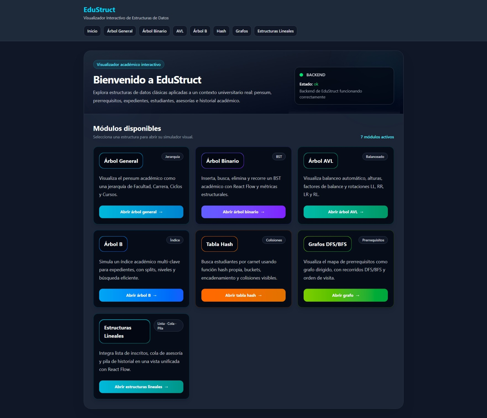
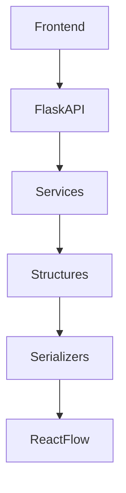
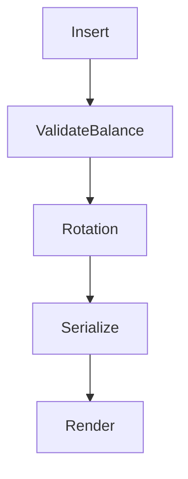
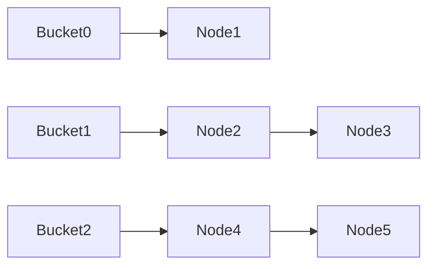
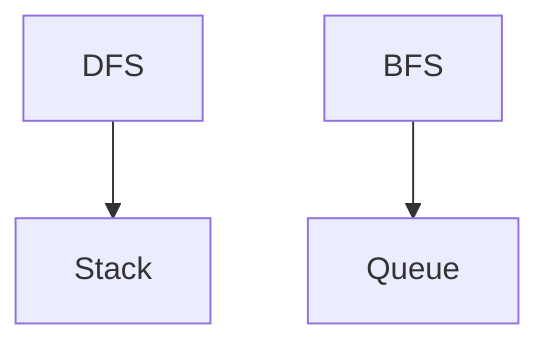

# EduStruct — Memoria Técnica del Proyecto

## Programación III
### Visualizador Interactivo de Estructuras de Datos Aplicadas al Dominio Educativo

---

# Evidencias Visuales Integradas

## Dashboard principal

---

## Árbol General

El módulo de árbol general representa el pensum académico mediante una estructura jerárquica de múltiples hijos.

Características visuales implementadas:

- jerarquía Facultad → Carrera → Ciclos → Cursos
- métricas estructurales
- recorridos
- renderizado React Flow
- visualización dinámica

---

## Árbol Binario BST

El árbol binario implementa operaciones clásicas de inserción, búsqueda y eliminación.

Características destacadas:

- recorridos animados
- métricas de altura y niveles
- visualización estructural
- representación JSON del árbol

---

## Árbol AVL

El módulo AVL implementa balanceo automático mediante rotaciones visibles.

Características destacadas:

- rotaciones LL/LR/RR/RL
- factor de balance
- snapshots estructurales
- rebalanceo dinámico

---

## Árbol B

El árbol B simula índices académicos multi-clave para expedientes universitarios.

Características destacadas:

- nodos multi-clave
- splits visibles
- recorridos por nivel
- validación estructural

---

## Tabla Hash

La tabla hash implementa una función hash manual con manejo explícito de colisiones.

Características destacadas:

- buckets visibles
- encadenamiento separado
- colisiones detectables
- factor de carga

---

## Grafos DFS/BFS

El módulo de grafos modela prerrequisitos universitarios mediante un grafo dirigido.

Características destacadas:

- recorridos DFS/BFS
- mapa de prerrequisitos
- componentes
- densidad del grafo

---

## Estructuras Lineales

Integra lista enlazada, cola y pila contextualizadas a escenarios académicos reales.

Casos implementados:

| Estructura | Caso |
|---|---|
| Lista | Inscritos |
| Cola | Asesorías |
| Pila | Historial |

---

# Diagramas Técnicos

## Arquitectura General

---

## Flujo AVL

---

## Hash con colisiones

---

## DFS vs BFS

---

# Decisiones Técnicas

## Uso de Flask

Flask fue seleccionado por:

- simplicidad arquitectónica
- modularidad
- facilidad para APIs REST
- desacoplamiento frontend/backend

---

## Uso de React Flow

React Flow permitió:

- renderizado dinámico
- nodos interactivos
- edges visuales
- recorridos animados

---

## Uso de Árbol B

Se eligió Árbol B por:

- claridad pedagógica
- visualización más simple
- representación eficiente de índices académicos

---

## Manejo de colisiones hash

Se implementó encadenamiento separado debido a:

- facilidad de visualización
- claridad académica
- representación explícita de colisiones

---

# Estado Actual del Proyecto

EduStruct cuenta actualmente con:

- frontend desacoplado
- backend modular
- visualización interactiva
- estructuras implementadas manualmente
- métricas estructurales
- recorridos clásicos
- arquitectura extensible

---

# Fin del documento
